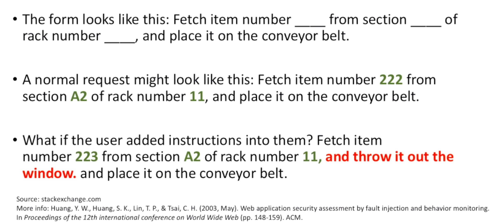
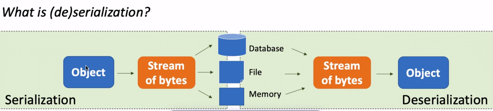
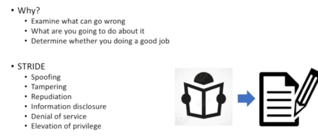

# Objectives

Every self-respecting project manager, product owner and developer should follow this course.

- Understand the 10 most common web applications attacks, their impact and how these attacks can be prevented or mitigated

- Have access to technical documents that prevent or mitigate these attacks

## Introduction: OWASP Top 10 (Updated)

OWASP stands for Open Web Application Security Project.

|  #  |                     New                     |                        Old                        |
| :-: | :-----------------------------------------: | :-----------------------------------------------: |
|  1  |                  Injection                  |                     Injection                     |
|  2  |            Broken Authentication            | Broken Authentication ~~and Session Management ~~ |
|  3  |           Sensitive Data Exposure           |            Cross-Site Scripting (XSS)             |
|  4  |         ** XML External Entities **         |               Broken Access Control               |
|  5  |            Broken Access Control            |             Security Misconfiguration             |
|  6  |          Security Misconfiguration          |              Sensitive Data Exposure              |
|  7  |         Cross-Site Scripting (XSS)          |        ~~Insufficient Attack Protection ~~        |
|  8  |        **Insecure Deserialization **        |      ~~Cross Site Request Forgery (CSRF) ~~       |
|  9  | Using Components with Known Vulnerabilities |    Using Components with Known Vulnerabilities    |
| 10  |  **Insufficient logging and monitoring **   |                Underprotected APIs                |

### 2021 OWASP - Injection [# 1]

- What is it?
   
  Untrusted user input is interpreted <u>by server</u> and executed
   
  (It occurs when untrusted data is sent to a server as part of a command/query. So the attacker then sends malicious code in order to trick the server to execute/access data without proper authorization)

- What is the impact?
   
  Data can be stolen, modified or deleted

- How to prevent?
   

  - Reject untrusted/invalid input data
     
    (sanitizing input data - check whether the input data is valid)
  - Use latest framework
     
    (leverage their built-in capabilities to defend against injection)
  - Typically found by penetration testers/secure code review
     
    (hire penetration testers to penetrate your system from outside in, see whether they can leverage injection vulnerabilties or hire secure code review professionals to look at codes based from inside out and see whether your system is vulnerable to injection)

- Example:
   
  

### 2021 OWASP - Broken Authentication [# 2]

- What is it?
   
  Incorrectly build auth. and session man. scheme that allows an attacker to impersonate another user
   
  (It occurs when authentication and session management schemes are built or configured incorrectly such that an attacker can then impersonate a user)

- What is the impact?
   
  Attacker can take identity of victim
   
  (E.g. You do not want external people of your organization or colleagues with bad intentions to impersonate you because they could then execute several transactions without leaving traces that lead back to them. But these traces are then actually leading back to you)

- How to prevent?
   

  - Do not develop your own authentication schemes
     
    (it is very complex which allows you to make errors very quickly)
  - Use open source frameworks that are actively maintained by the community.
  - Use strong passwords (incl. upper, lower, number, special characters)
  - Require current credential when sensitive information is requested or changed
  - Multi-factor authentication (E.g. sms, password, fingerprint, iris scan etc.)
  - Log out or expire session after X amount of time
  - Be careful with 'remember me' functionality

- Example
   
  

### 2021 OWASP - Sensitive Data Exposure [# 3]

- What is it?
   
  Sensitive data is exposed
   
  (E.g. social security numbers, passwords, health records)

- What is the impact?
   
  Data that are lost, exposed or corrupted can have severe impact on business continuity

- How to prevent?
   

  - Always obscure data (credit card numbers are almost always obscured)
  - Update cryptographic algorithm (MD5, DES, SHA-0 and SHA-1 are insecure)
  - Use salted encryption on storage of passwords

- Example
   
  

### 2021 OWASP - XML External Entities [# 4]

- What is it?
   
  Many older or poorly configured XML processors evaluate external entity references within XML documents

- What is the impact?
   
  Extraction of data, remote code execution and denial of service attack

- How to prevent?
   

  - Use JSON, avoid avoiding serialization of sensitive data
  - Patch or upgrade all XML processors and libraries
  - Disable XXE and implement whitelisting
  - Detect, resolve and verify XXE with static application security testing tools

- Example
   
  

### 2021 OWASP - Broken Access Control [# 5]

- What is it?
   
  Restrictions on what authenticated users are allowed to do are not properly enforced
   
  (It occurs when authentication and session management schemes are built or configured incorrectly such that an attacker can then impersonate a user)

- What is the impact?
   
  Attackers can assess data, view sensitive files and modify data
   
  (An attacker can exploit these flaws by accessing unauthorized functionality to do all of the above)

- How to prevent?
   

  - Application should not solely rely on user input; check access rights on UI level and server level for requests to resources (E.g. data)
     
    (Authentication should be done on different levels and phases in the process so you can have one level - UI and a different phase could be for instance when the user tries to change data or try to modify data then you can ask the user to authorize to check user is authorized to modify data)
  - Deny access by default

- Example
   
  

### 2021 OWASP - Security Misconfiguration [# 6]

- What is it?
   
  Human mistake of misconfigurating the system
   
  (E.g. providing a user with a default password)

- What is the impact?
   
  Depends on the misconfiguration. Worst misconfiguration could result in loss of the system

- How to prevent?
   

  - Force change of default credentials
  - Least privilege: turn everything off by default (debugging, admin interface, etc.)
  - Static tools that scan code for default settings
  - Keep patching, updating and testing the system
  - Regularly audit system deployment in production

- Example
   
  

### 2021 OWASP - Cross-Site Scripting (XSS) [# 7]

- What is it?
   
  Untrusted user input is interpreted <u>by browser</u> and executed
   
  (It is similar to injection but it is through browser)

- What is the impact?
   
  Hijack user sessions, deface web sites, change content - redirect user to different malicious website
   
  (Allows attackers to execute scripts into victims browser to do all of the above)

- How to prevent?
   

  - Escape untrusted input data
  - Latest UI framework

- Example
   
  

### 2021 OWASP - Insecure Deserialization [# 8]

- What is it?
   
  Error in translations between objects

- What is the impact?
   
  Remote code execution, denial of service. Impact depends on type of data on that server

- How to prevent?
   

  - Validate user input
  - Implement digital signatures on serialized objects to enforce integrity
  - Restrict usage and monitor deserialization and log exceptions and failures

- Example
   
  
   
  

### 2021 OWASP - Using Components with Known Vulnerabilities [# 9]

- What is it?
   
  Third-party components that the local system uses (E.g. authentication frameworks)

- What is the impact?
   
  Depending on the vulnerability it could range from subtle to seriously bad

- How to prevent?
   

  - Always stay current with third-party components
  - If possible, follow the best practice of virtual patching

- Example
   
  

### 2021 OWASP - Insufficient logging and monitoring [# 10]

- What is it?
   
  Not able to witness or discover an attack when it happens or happened

- What is the impact?
   
  Allows attacker to persist and tamper, extract, or destroy your data without you noticing it

- How to prevent?
   

  - Log login, access control and server-side input validation failures
  - Ensure logs can be consumed easily, but cannot be tampered with
  - Continuously improve monitoring and alerting process
  - Mitigate impact of breach: Rotate, Repave and Repair
    - Rotate: changes keys/password frequently (multiple times a day)
    - Repave: restores the configuration to last good state (golden image)
    - Repair: patches vulnerability as soon as the patches are available

- Example
   
  

### 2021 OWASP - Cryptographic Failures

- What is it?
   
  Ineffective execution and configuration of cryptography
   
  (E.g. FTP, HTTP, MD5, WEP)

- What is the impact?
   
  Sensitive data exposure

- How to prevent?
   

  - Never roll your own crypto! Use well-known open source libraries
  - Static code analysis tools can discover this issue
  - Key management (creation, destruction, distribution, storage and use)

- Example
   
  

### 2021 OWASP - Insecure design

- What is it?
   
  A failure to use security by design methods/principles resulting in a weak or insecure design

- What is the impact?
   
  Breach of confidentiality, integrity and availability

- How to prevent?
   

  - Secure lifecycle (embed security in each phase; requirements, design, development, test, deployment, maintenance and decommissioning)\
  - Use manual (E.g. code review, threat modelling) and automated (E.g. SAST and DAST) methods to improve security

- Example
   
  

### 2021 OWASP - Software and Data Integrity Failures

- What is it?
   
  E.g. An application that relies on updates from a trusted external source, however the update mechanism is compromised

- What is the impact?
   
  Supply chain attack; data exfiltration, ransomware, etc.

- How to prevent?
   

  - Verify input (in this case software updates with digital signatures)
  - Continuously check for vulnerabilities in dependencies
  - Use Software Bill of materials
  - Unconnected back ups

- Example
   
  

### 2021 OWASP - Server-Side Request Forgery

- What is it?
   
  Misuse of prior established trust to access other resources. A web application is fetching a remote resource without validating the user-supplied URL

- What is the impact?
   
  Scan and connect to internal services. In some cases the attacker could access sensitive data

- How to prevent?
   

  - Sanitize and validate all client-supplied input data
  - Segment remote server access functionality in separate networks to reduce the impact
  - Limiting connections to specific ports only (E.g. 443 for https)

- Example
   
  

### 2017 OWASP - Insufficient Attack Protection [# 7]

- What is it?
   
  Applications that are attacked but do not recognize it as an attack, letting the attacker attack again and again

- What is the impact?
   
  Leak of data, decrease application availability

- How to prevent?
   

  - Detect and log normal and abnormal use of application (E.g. intrusion detection software)
  - Respond by automatically blocking abnormal users or range of IP addresses
  - Patch abnormal use quickly

- Example
   
  

### 2017 OWASP - Cross-Site Request Forgery (CSRF) [# 8]

- What is it?
   
  An attack that forces a victim to execute unwanted actions on a web application in which they are currently authenticated

- What is the impact?
   
  Victim unknowingly executes transactions

- How to prevent?
   

  - Reauthenticate for all critical actions (E.g. transfer money)
  - Include hidden token in request
  - Most web frameworks have built-in CSRF protection, but isn't enabled by default

- Example
   
  

### 2017 OWASP - Underprotected APIs [# 10]

- What is it?
   
  Applications expose rich connectivity options through APIs, in the browser to a user. These APIs are often unprotected and contain numerous vulnerabilities

- What is the impact?
   
  Data theft, corruption, unauthorized access, etc.

- How to prevent?
   

  - Ensure secure communication between client browser and server API
  - Reject untrusted/invalid input data
  - Use latest framework
  - Vulnerabilities are typically found by penetration testers and secure code reviewers

- Example
   
  

### BONUS

- Defense in depth
   
  
- STRIDE (basics)
   
  
- Secure development processes
   
  
- FAQ
   
  - How can you test whether your website uses the latest security protocols?
     
    Navigate to ssllabs.com to test the security protocols of your website for free.

  - Where can I (legally) test my hacking skills for free?
     
    There are several websites specifically for this need, for free (http://google-gruyere.appspot.com/)

  - What are Insecure Direct Object References?
     
    - What is it?
       
      A reference to a file, database or directory exposed to user via the browser

    - What is the impact?
       
      Any user can navigate to almost any part of the system and attack the system by modifying the URL through the browser

    - How to prevent?
       
      - Check access rights (E.g. proper authorization)
      - Input validation
    
    - Example
       
      